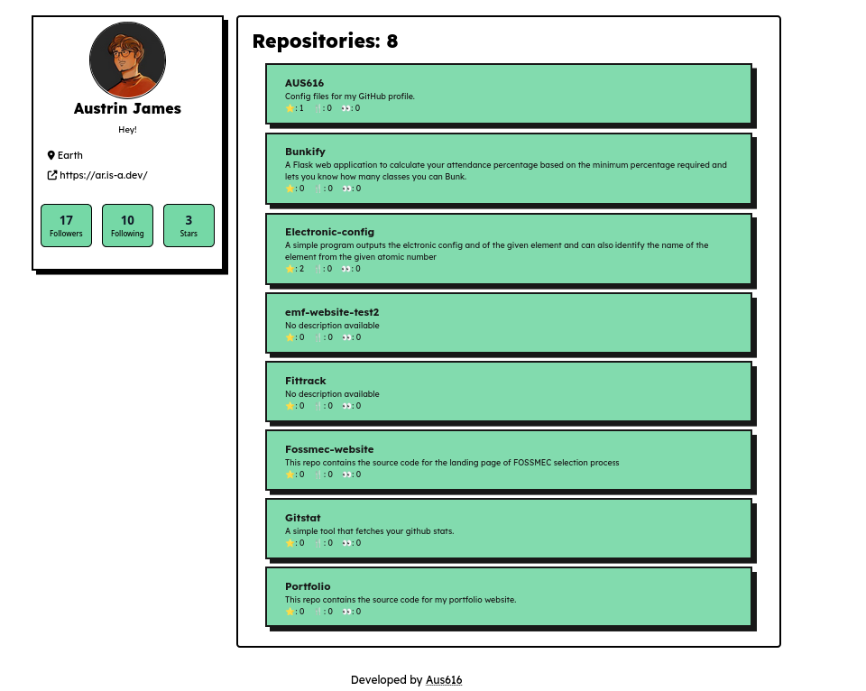

## Gitstat📈
A simple tool that fetches GitHub stats and displays them. Currently, it includes the following features:

- Profile Card: Displays basic information about the user, such as their avatar, name, bio, and followers.

- Repositories: Lists the user's repositories with essential details like name, description, and stars.

This project is a work in progress, and more features will be added soon! Contributions are welcome. The ui used [is](https://neo-brutalism-ui-library.vercel.app/).

## Tech stack 🛠️
 	 

## Screenshots



## Build
1. **Clone the Repository**:
   ```bash
   git clone https://github.com/AUS616/Gitstat.git
  
   
2. **Navigate to the Project Directory:**
    ```bash
   cd Bunkify 
3. **Create & activate the Virtual Environment:**
   ```bash
   python3 -m venv venv
   source venv/bin/activate  # On Windows use `venv\Scripts\activate`       

7. **Install Dependencies:**
   ```bash
   pip install -r requirements.txt
9. **Run the Application :**
    ```bash
   flask --app app run
